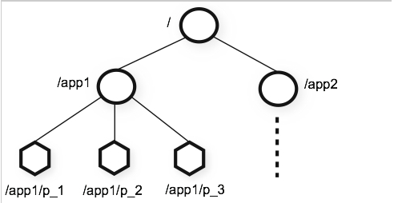

zookeeper overview
==
## 概述
ZooKeeper是一种用于分布式应用程序的分布式开源协调服务。它公开了一组简单的原语，分布式应用程序可以构建这些原语，以实现更高级别的服务，以实现同步，配置维护以及组和命名。它的设计易于编程，并使用在熟悉的文件系统目录树结构之后设计的数据模型。它在Java中运行，并且具有Java和C的绑定。  
众所周知，协调服务很难做到。他们特别容易出现诸如竞争条件和死锁等错误。ZooKeeper背后的动机是减轻分布式应用程序从头开始实施协调服务的责任。

## 设计目标
- **简单**：ZooKeeper允许分布式进程通过共享的层级命名空间相互协调，该命名空间与标准文件系统类似地组织。名称空间由数据寄存器组成 - 在ZooKeeper用语中称为znodes - 这些与文件和目录类似。与专为存储而设计的典型文件系统不同，ZooKeeper数据保存在内存中，这意味着ZooKeeper可以实现高吞吐量和低延迟数量。
- **可备份**：与它协调的分布式进程一样，ZooKeeper本身也可以在称为集合的一组主机上进行复制。
- **有序性**：ZooKeeper使用反映所有ZooKeeper事务顺序的数字标记每个更新。后续操作可以使用该顺序来实现更高级别的抽象，例如同步原语

- **快速**：它在“读取主导”工作负载中特别快。ZooKeeper应用程序在数千台计算机上运行，​​并且在读取比写入更常见的情况下表现最佳，比率大约为10：1。

## 数据模型和分层命名空间
ZooKeeper提供的名称空间非常类似于标准文件系统。名称是由斜杠（/）分隔的路径元素序列。ZooKeeper名称空间中的每个节点都由路径标识。

## 有条件的更新和监听
ZooKeeper支持watch(监听)的概念。客户端可以在znodes上设置监视。当znode更改时，将触发并删除监听器。当触发监听器时，客户端会收到一个数据包，说明znode已更改。如果客户端与其中一个Zoo Keeper服务器之间的连接中断，客户端将收到本地通知。这些可以用于[tbd]。

## 提供的保证
ZooKeeper非常快速且非常简单。但是，由于其目标是构建更复杂的服务（如同步）的基础，因此它提供了一系列保证。这些是：
- 顺序一致性 - 客户端的更新将按发送顺序应用。
- 原子性 - 更新成功或失败。没有部分结果。
- 单系统映像 - 无论服务器连接到哪个服务器，客户端都将看到相同的服务视图。
- 可靠性 - 一旦应用了更新，它将从那时起持续到客户端覆盖更新。
- 及时性 - 系统的客户视图保证在特定时间范围内是最新的。
有关这些以及如何使用它们的更多信息，请参阅 [tbd]

## 简单的API
ZooKeeper的设计目标之一是提供一个非常简单的编程接口。因此，它仅支持以下操作：
- 创建
在树中的某个位置创建一个节点

- 删除
删除节点

- 存在
测试某个位置是否存在节点

- 获取数据
从节点读取数据

- 设定数据
将数据写入节点

- 得到孩子
检索节点的子节点列表

- 同步
等待数据传播

## 实现
构成ZooKeeper服务的每个服务器都复制其自己的每个组件的副本。

Replicated Database是包含整个数据树的内存数据库。更新操作将持久化到磁盘以获取可恢复性，并且写入在应用于内存数据库之前会序列化到磁盘。  
每个ZooKeeper服务器都为客户端服务。客户端只连接到一台服务器以提交请求。read请求由每个服务器数据库的本地副本提供服务。更改服务状态，写请求的请求由协议协议处理。  

作为协议协议的一部分，来自客户端的所有写入请求都被转发到称为leader的单个服务器 。其余的ZooKeeper服务器（称为 follower）接收来自领导者的消息提议并同意消息传递。消息传递层负责替换失败的领导者并将关注者与领导者同步。

ZooKeeper使用自定义原子消息传递协议。由于消息传递层是原子的，因此ZooKeeper可以保证本地副本永远不会发散。当领导者收到写入请求时，它会计算应用写入时系统的状态，并将其转换为捕获此新状态的事务。

## 用途
ZooKeeper的编程接口非常简单。但是，使用它，您可以实现更高阶的操作，例如同步原语，组成员资格，所有权等。
- dubbo（注册/发现服务）
- kafka
- hbase
- hadoop

## 性能
ZooKeeper旨在提供高性能。ZooKeeper雅虎开发团队的成果！研究表明它是。（请参阅ZooKeeper吞吐量作为读写比率变化。）在**读取数量超过写入**的应用程序中，它的性能尤其高，因为写入涉及同步所有服务器的状态。（读取数量超过写入通常是协调服务的情况。）

## 可靠性
为了在出现故障时显示系统随时间的行为，我们运行了由7台机器组成的ZooKeeper服务。我们运行与之前相同的饱和度基准，但这次我们将写入百分比保持在恒定的30％，这是我们预期工作负载的保守比率。

这是图表中的一些重要观察结果。首先，**如果追随者失败并迅速恢复**，那么即使失败，ZooKeeper也能够维持高吞吐量。但也许更重要的是，**领导者选举算法** 允 许系统足够快地恢复以防止吞吐量大幅下降。在我们的观察中，ZooKeeper选择新领导者的时间不到200毫秒。第三，随着追随者的恢复，ZooKeeper能够在开始处理请求后再次提高吞吐量。
